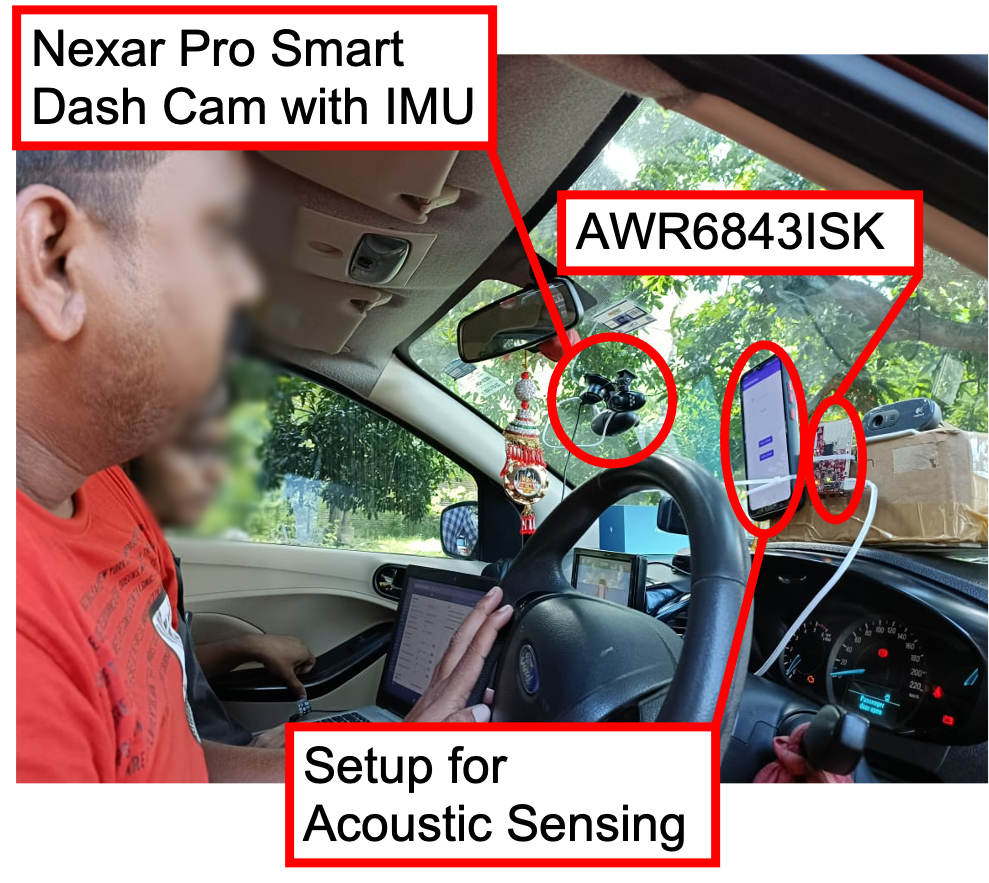
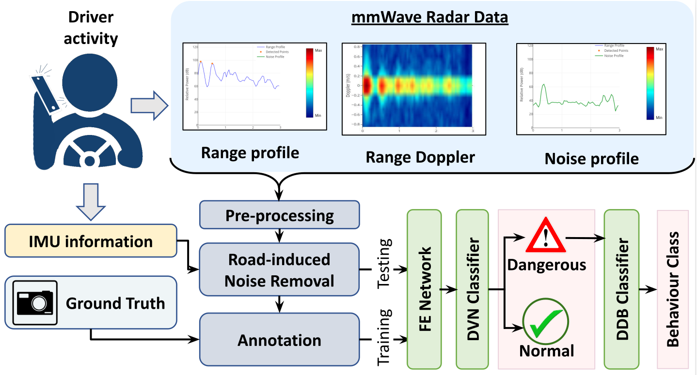

# <i>mmdrive</i> 

<table  cellspacing="0" cellpadding="0" style="border: none;">
<tr>
<td>

</td>
<td>

</td>
</tr>
</table>

In this work we explore the feasibility of purely using mmWave radars to detect dangerous driving behaviors. We then develop a novel Fused-CNN model to detect dangerous driving instances from regular driving and classify 9 different
dangerous driving actions. Through extensive  experiments with 5 volunteer drivers in real driving environments, we observe that our system can distinguish dangerous driving actions with an
average accuracy of 97(±2)%. 

## Installation:

To install use the following commands.
```bash
git clone https://github.com/arghasen10/mmdrive.git
pip install -r requirements.txt
```

## Directory Structure


```
mmdrive
└── models
    └── fused_cnn.py
    └── rf.py
    └── vgg_16.py
    └── helper.py
└── acoustic_fmcw
    └── Android
    └── post_process
    └── RF_Classifier
    └── README.md
└── dataset
    └── dataset_pub.pkl
└── mmwave_demo_visualizer
    └── README.md
```

## Description 

We have provided a sample subset of our dataset in the **dataset** directory. 

To run the Fused-CNN classifier or the other baselines check **models** directory.

In **mmwave_demo_visualizer** directory we have provided the instructions to run the demo visualizer for data collection as well as real time data visualization. This implementation is made by Texas Instruments and we have slightly modified the version to enable data collection and data annotations.

In **acoustic_fmcw** directory we have provided the source code for the acoustic range-doppler collection. 

<hr>

For questions and general feedback, contact Argha Sen (arghasen10@gmail.com).

